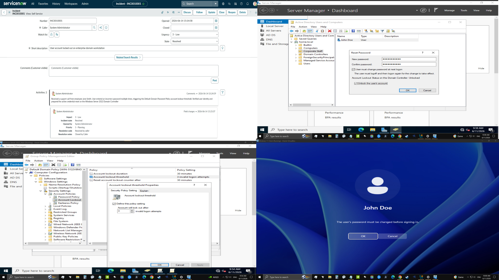

# Active-Directory-Enterprise-Hardening
Virtualized enterprise network deployment featuring user access controls, OU structure management, and secure workstation hardening solutions.

# Enterprise Active Directory Deployment & Core Infrastructure Lab

## 📋 Project Overview
This hands-on lab demonstrates the deployment of a secure corporate infrastructure utilizing a virtualized Windows Server 2022 Domain Controller and a Windows 11 Enterprise client workstation. The objective of this project is to solve core business security needs by centralizing user account management, organizing corporate departments via Organizational Units (OUs), implementing system-wide security baselines, and deploying secure network storage solutions.

## 🛠️ Technology Stack
* **Operating Systems:** Windows Server 2022 (Domain Controller), Windows 11 Enterprise (Client Workstation)
* **Hypervisor:** Oracle VirtualBox
* **Core Services:** Active Directory Domain Services (AD DS), Group Policy Management, Identity & Access Management (IAM), File Server Resource Manager (FSRM)

## 🏗️ Architecture & Implementation

### 1. Identity & Access Management (IAM)
* **Domain Infrastructure:** Deployed a local domain environment (`home.local`) to serve as the centralized authentication authority.
* **Organizational Unit (OU) Structure:** Formed physical corporate directory folders for distinct business departments (including Accounting, Sales, and IT) to isolate user assets properly.
* **User Provisioning:** Created and managed standard corporate user accounts (e.g., `Jane Smith`) directly inside dedicated department OUs to enforce proper privilege segregation.
* **Security Groups:** Built department-specific Security Groups (such as `Accounting_Data_Group`) to streamline resource access management and prepare for secure file sharing.

### 2. Help Desk & Lifecycle Operations
* **User Management:** Practiced administrative help desk workflows, including provisioning new employee accounts, managing object properties, and disabling stale accounts.
* **Credential Management:** Executed manual password resets, configured "user must change password at next logon" flags, and unlocked accounts within Active Directory Users and Computers (ADUC).

### 3. Group Policy Objects (GPOs) & Security Hardening
* **Workstation Hardening GPO:** Configured and linked a specialized security policy (`GPO_Workstation_Hardening`) targeting standard user objects to enforce corporate compliance across enterprise endpoints.
* **Default Domain Password Policy:** Configured global account security rules to enforce enterprise-grade password complexity, minimum length requirements, and lockout thresholds to protect the domain from brute-force authentication attacks.

### 4. Centralized File Services & Storage Security
* **Network Shares:** Configured a centralized `CompanyShares` directory on the file server to map network storage across corporate workstations.
* **NTFS & Share Permissions:** Implemented explicit security permissions, ensuring only authorized departmental security groups have access to sensitive folders (e.g., restricting `Accounting_Data` to the Accounting team) while configuring public drop folders with write-only protections.
